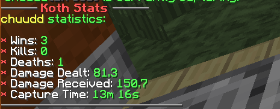
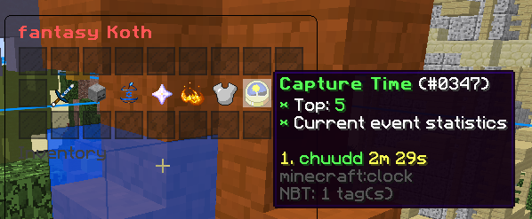
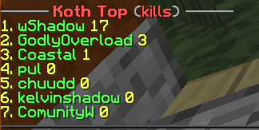
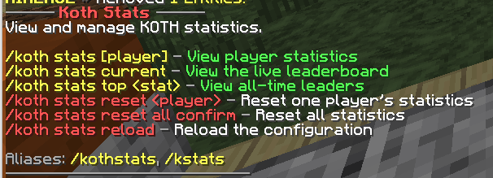

# KothStats

Spigot plugin for tracking player combat, captures, and live leaderboards during FactionsKore KOTH events.

## Setup

1. Install Java 8+ and a Spigot 1.8.8/1.8.9 server.
2. Install FactionsKore.
3. Install PlaceholderAPI for automatic KOTH and capturer detection.
4. Put `KothStats-1.5.4.jar` in the server's `plugins` folder.
5. Start the server to generate the configuration.
6. Edit `plugins/KothStats/config.yml`.
7. Run `/koth stats reload`.

KothStats automatically scans `plugins/FactionsKore` for KOTH names and capture regions.

## Commands

- `/koth stats [player]` - view player statistics
- `/koth stats current` - open the live KOTH leaderboard
- `/koth stats top <stat>` - view an all-time leaderboard
- `/koth stats reset <player>` - reset one player
- `/koth stats reset all confirm` - reset every player
- `/koth stats reload` - reload the configuration
- `/koth stats help` - show the command list

`/kothstats` and `/kstats` can also be used.

Available leaderboard statistics are `kills`, `deaths`, `damage-dealt`, `damage-received`, and `capture-time`.

## Permissions

Every permission node can be changed under `permissions` in `config.yml`. The
default nodes are:

- `kothstats.view` - view personal statistics
- `kothstats.view.others` - view another player's statistics
- `kothstats.top` - view all-time leaderboards
- `kothstats.current` - open the live leaderboard
- `kothstats.admin.reload` - reload the plugin
- `kothstats.admin.reset` - reset one player
- `kothstats.admin.resetall` - reset every player
- `kothstats.cooldown.bypass` - bypass command cooldowns

Player permissions are enabled by default. Administrative permissions default to server operators.

To change a permission node, replace its value under `permissions` and run
`/koth stats reload`. For example:

```yaml
permissions:
  view: "myserver.kothstats.view"
  reset: "myserver.kothstats.admin.reset"
```

## Configuration

The live GUI can be customized from `current-koth.gui` in `config.yml`.

You can change:

- Menu title, size, slots, and leaderboard length
- Item materials, data values, amounts, names, and lore
- Filler panes and stat visibility
- Rank colours and leaderboard formats
- Plugin messages and colours
- Capture regions, combat radius, and anti-farming cooldown

The default GUI uses a Paradise-style light blue, aqua, blue, and dark blue theme.

## Placeholders

- `%kothstats_kills%`
- `%kothstats_deaths%`
- `%kothstats_damage_dealt%`
- `%kothstats_damage_received%`
- `%kothstats_capture_seconds%`
- `%kothstats_capture_time%`
- `%kothstats_koth_wins%`

## Build

Run:

```powershell
.\gradlew.bat build
```

The plugin will be created at `build/libs/KothStats-1.5.4.jar`.

## Pictures

### Player Statistics



### Live KOTH Leaderboard



### All-Time Leaderboard



### Command Help


